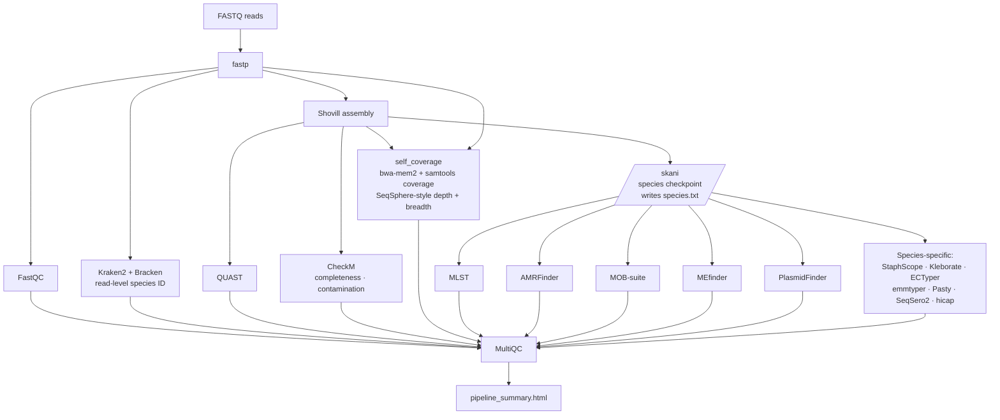
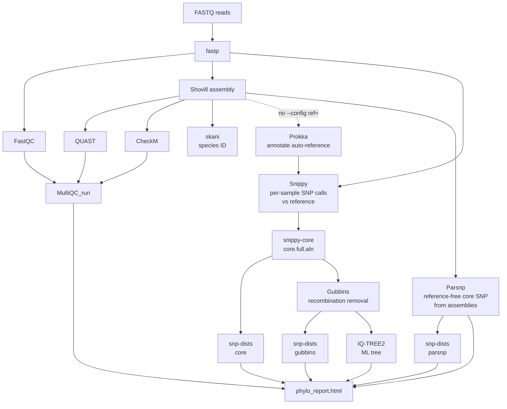
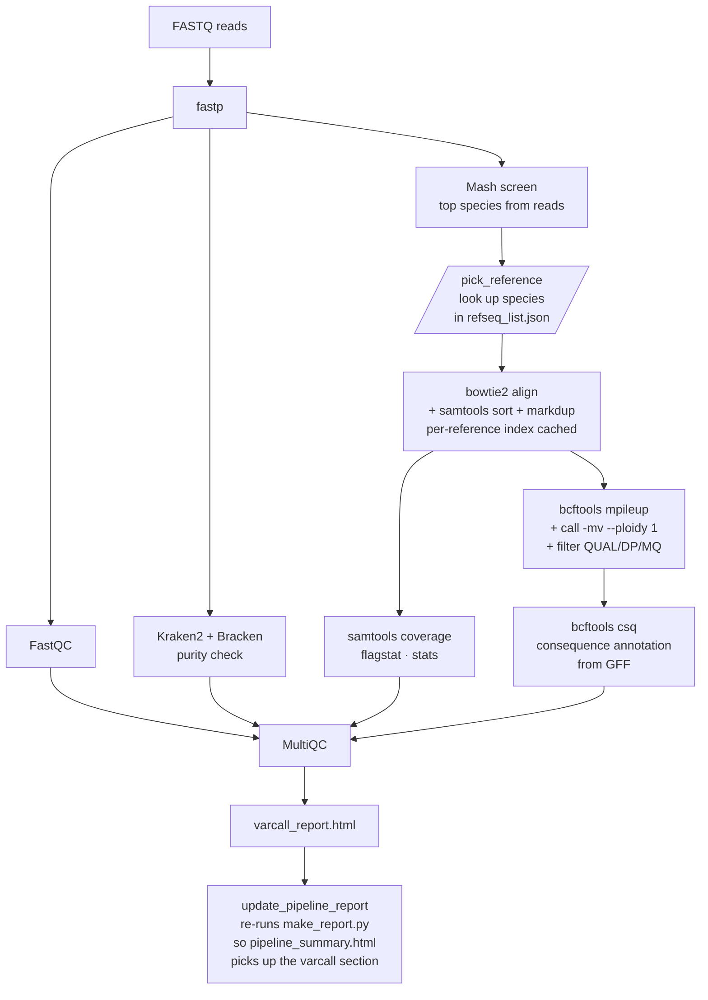
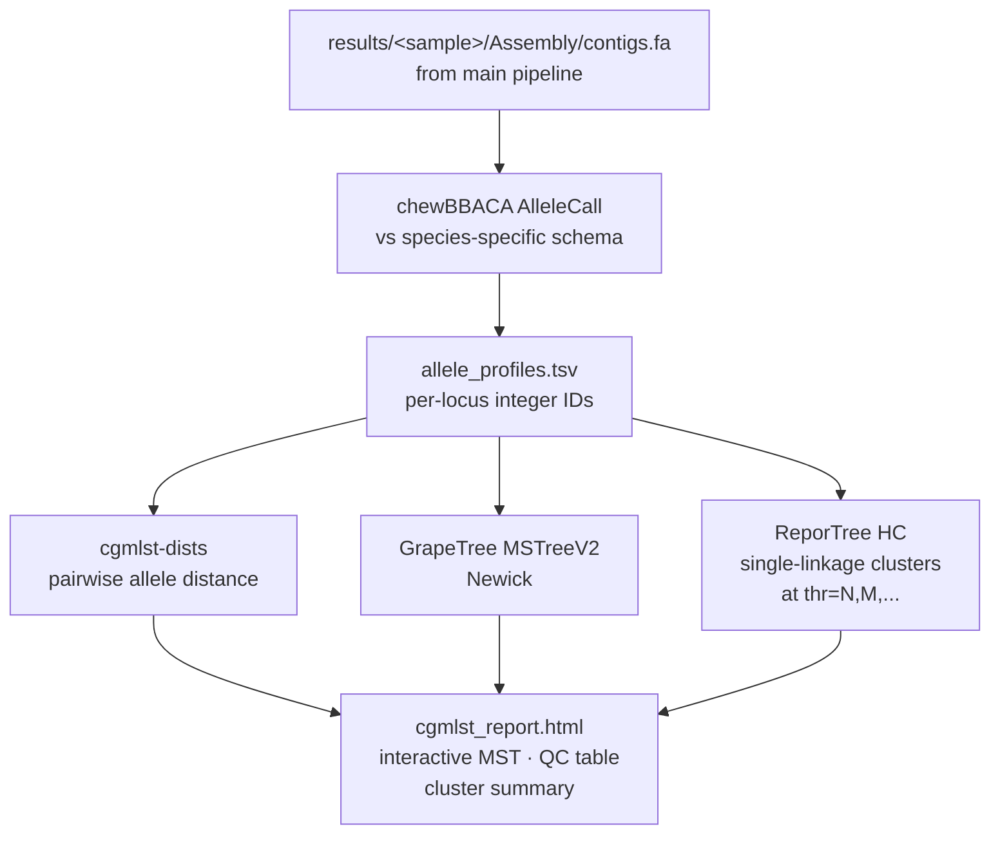

# Bacterial Genomics Pipeline

Snakemake pipeline for whole-genome sequencing of clinical bacterial isolates — trimming, assembly, species identification, resistance, typing, SNP phylogenomics, and cgMLST cluster analysis.

---

## Requirements

- Linux (tested on Ubuntu/Fedora)
- [Pixi](https://pixi.sh) installed (`curl -fsSL https://pixi.sh/install.sh | bash`)

---

## Installation

```bash
git clone https://github.com/OddAlexander/Genomics-Workflow.git ~/genomics
cd ~/genomics
pixi install
```

### Databases

**Kraken2** — recommended: PlusPF 8 GB (~8 GB, requires ≥16 GB RAM)

**skani** (~3 GB sketch, ~25 GB temporary during build with FastANI)

**MOB-suite** (~1.5 GB): `pixi run --environment mobsuite mob_init`

**AMRFinder**: `pixi run --environment amrfinder4 amrfinder --update`

**CheckM** (~1.4 GB)

**cgMLST schemas** (required only for the cgMLST pipeline) — chewBBACA-prepared
schemas, one per species, placed under `/databases/cgmlst/<species>/`. See
[Snakefile_cgmlst](Snakefile_cgmlst) for the default per-species paths
(override with `--config cgmlst_schemas=...` or
`--config cgmlst_schema=/path` to apply one schema to all samples).

```bash
# Example: download a Ridom cgMLST schema, prepare with chewBBACA
mkdir -p /databases/cgmlst/staph_aureus
pixi run --environment chewbbaca chewBBACA.py PrepExternalSchema \
    -g /path/to/raw_schema -o /databases/cgmlst/staph_aureus --cpu 8
```

---

## Repository layout

```text
.
├── Snakefile              main pipeline (QC, assembly, ID, AMR, typing)
├── Snakefile_phylo        phylogenomics (Snippy → Gubbins → IQ-TREE + Parsnp)
├── Snakefile_varcall      reference mapping + bcftools variant calling
├── Snakefile_cgmlst       cgMLST allele calling + ReporTree clustering
├── config.yaml            shared configuration for all four pipelines
├── refseq_list.json       species → reference FASTA/GFF map (varcall)
├── rules/
│   └── common.smk         shared helpers: filter_samples, assert_unique_samples
└── scripts/
    ├── make_report.py             per-sample report (main pipeline)
    ├── make_phylo_report.py       multi-sample report (phylo)
    ├── make_cgmlst_report.py      multi-sample report (cgMLST)
    ├── make_varcall_report.py     per-sample report (varcall)
    ├── build_refseq_list.py       auto-generates refseq_list.json from /databases/refseq/
    ├── pixi/                      pixi convenience wrappers (e.g. Prokka annotation)
    └── templates/                 Jinja-style HTML templates consumed by the make_*_report.py scripts
        ├── report_template.html
        ├── report_template_phylo.html
        ├── report_template_cgmlst.html
        └── report_template_varcall.html
```

---

## Usage

### Input format

```
data/
└── 26-03-2026/
    ├── 001k/
    │   ├── 001k_R1.fastq.gz
    │   └── 001k_R2.fastq.gz
    └── 002k/
        ├── 002k_R1.fastq.gz
        └── 002k_R2.fastq.gz
```

Filenames can be anything, but must end with `_R1.fastq.gz` / `_R2.fastq.gz`.

### Main pipeline (`Snakefile`)

```bash
# Dry run
pixi run snakemake -n --cores 16

# One sample / one date / multiple samples / all
pixi run snakemake --cores 16  --config samples=001k
pixi run snakemake --cores 16  --config samples=19-03-2026
pixi run snakemake --cores 16  --config "samples=[001k,002k]"
pixi run snakemake --cores 16 

# One specific file
pixi run snakemake results/26-03-2026/001k/MLST/mlst.tsv
```

Each run appends one row per sample to `results/run_log.tsv` (sample ID, SKANI species, skani hit + ANI, Bracken top, MLST ST, species-specific typing, date). Re-running a sample replaces its prior row, so the file always reflects the latest call per sample — a single, cumulative summary across all runs.

**Per-sample HTML report** at `results/<sample>/pipeline_summary.html` surfaces three depth numbers side-by-side:

- **Depth (est.)** — `fastp` trimmed bases ÷ `QUAST` assembled length. Upper bound; no remapping.
- **Depth (mapped)** — `bwa-mem2` self-mapping of trimmed reads back to the sample's own Shovill assembly, summarised by `samtools coverage`. SeqSphere-equivalent, mapping-verified, **reference-free**.
- **Depth (vs ref)** — *only present after the varcall pipeline has run* — `samtools coverage` on the varcall pipeline's `bowtie2`-mapped BAM against the chosen NCBI reference. The gap between "mapped" and "vs ref" surfaces strain divergence + reference-content mismatch.

### Phylogenomics pipeline (`Snakefile_phylo`)

Runs independently of the main pipeline — takes raw reads directly as input.

```bash
# With an external reference (.gbk from Prokka — recommended)
pixi run snakemake -s Snakefile_phylo --cores 16 \
    --config ref=/databases/prokka_refs/example.gbk

# Without reference — first sample is auto-annotated with Prokka
pixi run snakemake -s Snakefile_phylo --cores 16

# Filter by date or sample ID
pixi run snakemake -s Snakefile_phylo --cores 16 \
    --config ref=... samples=19-03-2026
pixi run snakemake -s Snakefile_phylo --cores 16 \
    --config ref=... "samples=[005a,007b]"

# Custom run name (default: date+time)
pixi run snakemake -s Snakefile_phylo --cores 16 \
    --config ref=... run_name=Salmonella_outbreak

# SNP threshold for outbreak cluster coloring in the report
pixi run snakemake -s Snakefile_phylo --cores 16 \
    --config ref=... snp_threshold=20
```

Output is written to `<results_base>/phylo/<run_name>/` (default: `/srv/phylo_results/$USER/phylo/DD-MM-YYYY_HHMM`).
Override either piece with `--config results_base=/path/to/parent run_name=salmonella_outbreak`.

```
/srv/phylo_results/odd/phylo/07-05-2026_1621/
├── <date>/<sample-id>/
│   ├── Trimmed/      fastp
│   ├── QC/           FastQC + fastp JSON + HTML
│   ├── Assembly/     Shovill
│   ├── QUAST/
│   ├── CheckM/       quality.tsv (completeness, contamination)
│   ├── ID_Skani/     species identification (species.txt)
│   ├── Prokka/       only for auto-reference (first sample)
│   └── MultiQC/
├── Snippy/
│   └── <sample-id>/  snippy SNP calling against reference
├── Core/             snippy-core — core.full.aln
├── Gubbins/          recombination-filtered alignment + tree (hybrid: FastTree/RAxML)
│                     gubbins.recombination_predictions.gff
├── Parsnp/           parsnp.tree, parsnp.vcf, parsnp.snps.fasta
│                     (reference-free core SNP analysis from assemblies)
├── SNP_Dists/        snp_dists.tsv (raw core) + snp_dists_gubbins.tsv (recombination-filtered)
│                     + snp_dists_parsnp.tsv (Parsnp SNP-only alignment)
├── IQtree/           iqtree.treefile (GTR+G, UFBoot 1000; skipped if < 3 taxa)
├── MultiQC_run/      multiqc_report.html (aggregated QC for the full run)
└── phylo_report.html sample overview, reference, SNP matrices, recombination summary,
                      Snippy + Parsnp trees, and tool versions
```

The phylo report SNP matrices support threshold-based cluster coloring when `snp_threshold` is set: cells ≤ threshold are shaded green (same cluster), cells > threshold are shaded red (different cluster).

#### Creating custom references

```bash
scripts/pixi/pixi_annotate_prokka.sh 19-03-2026
scripts/pixi/pixi_annotate_prokka.sh 19-03-2026/005a --genus Staphylococcus --species aureus
```

### Variant-calling pipeline (`Snakefile_varcall`)

Reference-based read mapping and bcftools variant calling against an NCBI reference
picked automatically via Mash screen on the trimmed reads — no assembly required,
species ID is available pre-mapping. Outputs sit alongside the main pipeline's
per-sample tree at `results/<sample>/VarCall/`.

Requires a `refseq_list.json` in the project root (next to the Snakefile)
that maps each supported species (underscored "Genus_species") to a FASTA
(and optionally a GFF for variant annotation):

```json
{
  "Klebsiella_pneumoniae": {
    "fasta": "/databases/refseq/kpneumo/GCF_000240185.1.fna",
    "gff":   "/databases/refseq/kpneumo/GCF_000240185.1.gff"
  },
  "Staphylococcus_aureus": {
    "fasta": "/databases/refseq/saureus/GCF_000013425.1.fna",
    "gff":   "/databases/refseq/saureus/GCF_000013425.1.gff"
  }
}
```

If Mash screen's top hit isn't in the JSON, the pipeline fails loudly for that
sample. Omit the `gff` to skip `bcftools csq` annotation for that species.

```bash
# All samples
pixi run snakemake -s Snakefile_varcall --cores 16 

# Filter by date / sample / list (same syntax as the main pipeline)
pixi run snakemake -s Snakefile_varcall --cores 16 --config samples=19-03-2026
pixi run snakemake -s Snakefile_varcall --cores 16 --config "samples=[001k,002k]"

# Point at a different refseq_list.json
pixi run snakemake -s Snakefile_varcall --cores 16 \
    --config refseq_list=/path/to/my_refseqs.json
```

Per-sample output (relative to `results/<sample>/`):

```text
VarCall/
├── Mash/
│   ├── screen.tsv             top-N Mash screen hits (sorted by containment)
│   └── reference.tsv          chosen species + paths to FASTA & GFF
├── Bowtie2/
│   ├── aligned.bam            coordinate-sorted, duplicate-marked
│   └── aligned.bam.bai
├── QC/
│   ├── coverage.tsv           samtools coverage (per-contig depth/breadth)
│   ├── flagstat.txt           samtools flagstat (mapping rate, properly paired)
│   └── samtools_stats.txt     full samtools stats (consumed by MultiQC)
├── VCF/
│   ├── variants.vcf.gz        bcftools call -mv → filter (QUAL, DP, MQ)
│   └── variants.annotated.vcf.gz   bcftools csq if GFF available
├── MultiQC/multiqc_report.html
└── varcall_report.html        per-sample HTML report
```

The varcall report shows **real** mapping-based depth/breadth (from
`samtools coverage`) and mapping rate (from `samtools flagstat`) — not the
assembly-length estimate used in the main per-sample report. It also surfaces
the Mash screen top hits (useful for spotting contamination), variant counts
broken down by PASS/filtered, Ts/Tv ratio, and a top-N variant table annotated
with gene + consequence when the reference GFF is available.

**Main-report refresh.** After `varcall_report` finishes for a sample, an
`update_pipeline_report` rule re-runs `make_report.py` so the main
`pipeline_summary.html` picks up the new "Reference mapping (from varcall
pipeline)" card with reference-mapped depth, mapping rate, and PASS/filtered
variant counts. The card appears only on samples where varcall has been run;
others render exactly as the main pipeline produced them. Recommended workflow:

```bash
pixi run snakemake --cores 16                              # main pipeline first
pixi run snakemake -s Snakefile_varcall --cores 16         # then varcall (also refreshes the main reports)
```

A bowtie2 index per unique reference is built once and cached under
`results/.bowtie2_indices/`, shared across samples.

### cgMLST pipeline (`Snakefile_cgmlst`)

Allele-based outbreak typing — reads assemblies produced by the main pipeline
(so run that first), calls cgMLST loci with chewBBACA against a species-specific
schema, builds an allele distance matrix, and clusters samples at one or more
allele-distance thresholds with ReporTree (single-linkage hierarchical).

All samples in a single run must resolve to the same schema — filter by date
or sample ID if your run mixes species.

```bash
# All samples in a date (auto-detects schema from results/<sample>/species.txt)
pixi run snakemake -s Snakefile_cgmlst --cores 16 --config samples=19-03-2026

# A specific subset
pixi run snakemake -s Snakefile_cgmlst --cores 16 \
    --config "samples=[005a,007b]"

# Multiple clustering thresholds + custom run name
pixi run snakemake -s Snakefile_cgmlst --cores 16 \
    --config samples=19-03-2026 cgmlst_threshold=5,10,24 run_name=staph_may

# Override schema (skip auto-detection)
pixi run snakemake -s Snakefile_cgmlst --cores 16 \
    --config samples=19-03-2026 cgmlst_schema=/databases/cgmlst/staph_aureus
```

Output is written to `<results_base>/cgmlst/<run_name>/` (default: `/srv/phylo_results/$USER/cgmlst/DD-MM-YYYY_HHMM`).
Shares the `results_base` key with the phylo pipeline; the `cgmlst/` / `phylo/` segments
keep their outputs in separate trees so the same `run_name` is safe for both.

```text
/srv/phylo_results/odd/cgmlst/14-05-2026_1851/
├── allele_profiles.tsv         chewBBACA per-sample allele calls
├── cgmlst_dists.tsv            pairwise allele distance matrix
├── grapetree.nwk               Newick tree (GrapeTree-compatible)
├── cluster_partitions.tsv      ReporTree cluster assignments per threshold
├── cluster_*.tsv               supporting ReporTree outputs
└── cgmlst_report.html          interactive HTML report
                                (sample QC, MST, SNP matrix, cluster table)
```

The cgMLST report includes an interactive **minimum spanning tree** (draggable
nodes, pan/zoom, cluster colouring), a per-sample QC table with **Top sp.%**
(Kraken2/Bracken purity), **Q30**, **est. depth**, **contigs**, **N50**, and
**% called** (chewBBACA loci resolved to a clean integer allele), with a
collapsible explainer for what the failure tags (`LNF`, `LOTSC`, `NIPH`, etc.)
mean.

---

## Pipeline overview

Diagrams below use Mermaid; GitHub and most Markdown viewers render them as
visual flowcharts. Decision nodes (parallelograms) mark the Snakemake checkpoint
that routes the DAG based on species ID.

### Main pipeline — DAG



### Phylogenomics pipeline — DAG



### Variant-calling pipeline — DAG



### cgMLST pipeline — DAG



---

## Species-specific typing

| Species | Tool | Output |
|---------|------|--------|
| *S. aureus* | StaphScope | spa type, SCCmec, MRSA/MSSA, virulence, lineage |
| *Klebsiella* spp. + *E. coli* | Kleborate v3 | K/O type, ESBL, carbapenemase, virulence |
| *S. pyogenes* | emmtyper | emm type |
| *P. aeruginosa* | Pasty | O-antigen serotype |
| *Salmonella* spp. | SeqSero2 | O and H antigen serotyping |
| *H. influenzae* | hicap | Capsule type (a–f / non-typeable) |
| All | MEfinder | Insertion sequences and transposons |
| All | MOB-suite | Plasmid typing (relaxase, conjugation) |

ECTyper (*E. coli* O:H serotyping) requires a MASH sketch from Zenodo:

```bash
mkdir -p databases/ectyper
wget -O databases/ectyper/EnteroRef_GTDBSketch_20231003_V2.msh \
    "https://zenodo.org/records/13969103/files/EnteroRef_GTDBSketch_20231003_V2.msh?download=1"
```

---

## Configuration (`config.yaml`)

| Parameter | Default | Description |
|-----------|---------|-------------|
| `data_dir` | `data/` | Directory containing FASTQ files |
| `results_dir` | `results/` | Output directory |
| `threads` | `8` | Threads per rule |
| `kraken2_db` | `/databases/kraken2_db_light/` | Kraken2 database |
| `kraken2_mem_mb` | `12000` | MB RAM per Kraken2 job |
| `skani_db` | `/databases/skani_db/bacteria` | skani sketch database (drives species ID checkpoint) |
| `skani_mem_mb` | `4000` | MB RAM per skani job |
| `skani_threads` | `8` | Threads per skani job |
| `shovill_mem_mb` | `12000` | MB RAM per Shovill job |
| `checkm_mem_mb` | `16000` | MB RAM per CheckM job (lineage_wf `--reduced_tree`) |

**Shared options for the phylo + cgMLST pipelines** (set in `config.yaml` or via `--config`):

| Parameter | Default | Description |
|-----------|---------|-------------|
| `results_base` | `/srv/phylo_results/$USER` | Parent for phylo + cgMLST. Each pipeline auto-appends `phylo/` or `cgmlst/` underneath, so the same `run_name` is safe for both. |
| `run_name` | `DD-MM-YYYY_HHMM` | Subdirectory under `<results_base>/phylo/` and `<results_base>/cgmlst/` |

**Phylogenomics-only options** (passed via `--config`):

| Parameter | Default | Description |
|-----------|---------|-------------|
| `ref` | *(first sample)* | Path to reference `.gbk` (Prokka-annotated) |
| `snp_threshold` | `0` (disabled) | SNP cutoff for cluster coloring in the report |
| `mincov` | `10` | Snippy minimum read coverage |
| `minfrac` | `0.9` | Snippy minimum allele frequency |

**cgMLST-only options** (passed via `--config`):

| Parameter | Default | Description |
|-----------|---------|-------------|
| `cgmlst_threshold` | `7` | Allele-distance cutoff(s) for ReporTree clustering (single int or comma-separated list, e.g. `5,10,24`) |
| `cgmlst_schema` | *(auto)* | Override schema for the whole run (skips per-sample auto-detection) |
| `cgmlst_schemas` | *(built-in)* | YAML dict mapping species → schema path (see [Snakefile_cgmlst](Snakefile_cgmlst)) |

---

## Troubleshooting

```bash
# View log
cat results/26-03-2026/001k/logs/amrfinder.log

# Force rerun of one rule
pixi run snakemake --cores 16 --forcerun amrfinder

# Resume an interrupted run
pixi run snakemake --cores 16 --rerun-incomplete
```

---

## Tools

| Tool | Version | Purpose |
|------|---------|---------|
| fastp | ≥0.23 | Read trimming |
| FastQC + MultiQC | ≥0.12 | Sequence quality |
| Shovill | ≥1.1 | Assembly (SPAdes) |
| QUAST | ≥5.2 | Assembly statistics |
| CheckM | ≥1.2 | Assembly completeness and contamination (lineage-based marker genes) |
| Kraken2 + Bracken | ≥2.1 | Species identification (reads) |
| skani | ≥0.2 | ANI-based species identification (assembly) — controls DAG routing |
| MLST | ≥2.23 | Sequence typing (PubMLST) |
| AMRFinder | v4.x | Resistance and virulence genes |
| MOB-suite | ≥3.1 | Plasmid typing |
| MobileElementFinder | ≥1.0 | MGE detection |
| StaphScope | ≥1.0 | *S. aureus*: spa, SCCmec, MRSA, virulence, lineage |
| emmtyper | ≥0.2 | *S. pyogenes* emm typing |
| Kleborate | ≥3.0 | *Klebsiella* / *E. coli* typing |
| Pasty | ≥2.2 | *P. aeruginosa* O-antigen |
| SeqSero2 | ≥1.3 | *Salmonella* serotyping |
| hicap | ≥1.0 | *H. influenzae* capsule type |
| Snippy + snippy-core | ≥4.6 | SNP calling and core alignment |
| Gubbins | ≥3.3 | Recombination removal |
| IQ-TREE2 | ≥2.2 | ML phylogenetic tree |
| Parsnp | ≥2.0 | Reference-free core SNP analysis from assemblies (parallel to Snippy + Gubbins) |
| snp-dists | ≥0.8 | Pairwise SNP distances |
| Mash | ≥2.3 | Reads-based species ID (Snakefile_varcall) |
| Bowtie2 | ≥2.5 | Read alignment for variant calling |
| samtools | ≥1.19 | BAM sort/index/markdup, coverage, flagstat |
| bcftools | ≥1.19 | Variant calling, filtering, consequence annotation (csq) |
| Prokka | ≥1.14 | Annotation for custom reference genomes |
| chewBBACA | ≥3.3 | cgMLST allele calling |
| cgmlst-dists | ≥0.4 | Pairwise allele-distance matrix |
| GrapeTree | ≥2.2 | Newick tree from allele profiles |
| ReporTree | latest | Single-linkage hierarchical clustering of cgMLST profiles |
